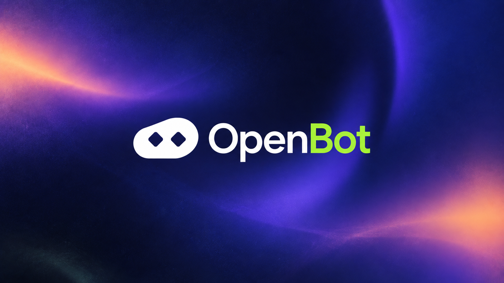

<div align="center">



# Navin OpenBot

**Start with the work, not the stack.**

Navin OpenBot brings together the right crew, models, harnesses, tools, and machines around the job, with every part yours to configure, replace, and shape however you want.

[](./LICENSE)
[](#project-status)

[Website](https://openbot.navinresearch.com/) · [Documentation](./docs) · Marketplace · Community

</div>

---

> **Project status**
>
> OpenBot is in early development, and the source is **not publicly released yet**.
>
> The code will be published once it has completed testing, verification, and operational validation in enterprise deployments. Until then, OpenBot is a commercial product and this repository documents the project rather than distributing a working build.
>
> The concepts below describe both working components and the direction of the project. Features that are not ready are marked accordingly.

## What it is

OpenBot is a place to hand off real work.

Give it a job and it brings together the people-shaped roles, models, tools, harnesses, and machines needed to carry that work through. You can keep it simple with one worker and one task, or build a complete crew with different roles, tools, permissions, memory, and ways of working.

Nothing important has to be fixed. Change the model. Replace the harness. Move execution from your laptop to a server. Swap a tool. Add another worker. Remove one. Build your own runtime.

OpenBot adapts around the work instead of forcing the work into one stack.

## Quick start

OpenBot is not ready for a stable public installation yet. Installation instructions will be added when the first usable release is available.

Until then, the entry point is the design documentation in [`docs/`](./docs).

## Features

### Any model

Use the models that make sense for the task. OpenBot is designed around a provider-neutral model interface covering hosted APIs, local models, and compatible custom endpoints.

The goal is not simply to support many models — it is to let different work use different intelligence.

### Any harness

A model does not have to be the worker. Agent harnesses are treated as replaceable execution layers.

Planned adapters include native OpenBot workers, Claude Code, Codex, OpenCode, Pi, OpenHands, compatible third-party harnesses, and custom adapters. A coding job may use a coding harness. A private task may stay entirely local.

### Any machine

Execution should happen where it makes sense: local computers, cloud machines, user-owned VPS instances, isolated sandboxes, remote hosts, GPU machines, private infrastructure, and edge devices.

The default stays simple:

```text
Run on: Auto
```

Advanced users can control every part.

### Crew

OpenBot calls a working group a **Crew** — one worker or many. Each member can have its own role, instructions, model, harness, tools, memory, permissions, runtime, budget, and approval rules.

A simple task may only need one worker. A product task might form a crew of research, builder, reviewer, and QA. The crew changes with the job.

### Cards and Decks

**Cards** are reusable pieces of an OpenBot setup, packaged so capability does not have to live in one giant configuration file: Agent, Model, Skill, Tool, Memory, Runtime, Policy, Trigger, Trap, and Brain Cards.

A **Deck** is a portable working setup — crew, skills, tools, memory, policies, and runtime bundled together. A user should be able to start with `Equip Deck` and customize anything later.

### Ways to work

| Mode | What it is |
| --- | --- |
| **Solo** | One person and one worker, for straightforward jobs. |
| **Cowork** | You stay inside the loop and intervene whenever you want. |
| **Dual** | One worker does the job, another checks it independently. |
| **Team** | Multiple specialized workers collaborate on the same outcome. |
| **Arena** | Different configurations run the same job, constraints, and budget, so you measure results instead of guessing. |

### Learn from the work

The learning loop is `Reason → Execute → Verify → Learn → Reuse`. When a workflow succeeds, OpenBot can preserve what mattered, and repeated work can gradually move from expensive general reasoning toward reusable execution.

The general model remains available when something new or uncertain happens. Use reasoning where reasoning is useful; reuse what already works.

### Memory

Different kinds of memory do not all live in one bucket. Memory is scoped from user through organization, workspace, project, crew, worker, and task down to temporary context, and it can carry ownership, provenance, permissions, confidence, and lifetime.

A worker should only see what it needs.

### Routing

Routing decides more than which model to call. It may consider task, complexity, cost, latency, privacy, available tools, runtime, historical success, context requirements, and permissions, then select the worker, model, harness, runtime, and tools.

Manual control remains available.

### Human control

Autonomy should have boundaries. Permissions and approval points are explicit, and different workers can have different permissions — a researcher does not need production access, and a deployment worker does not need every company secret.

| Action | Policy |
| --- | --- |
| Sending email | Ask first |
| Production deployment | Ask first |
| Deleting data | Ask first |
| GitHub read | Allow |
| GitHub write | Scoped |
| External network | Restricted |
| Maximum task cost | $5 |

### Runs, replay, and evaluation

Runs should be inspectable — worker, model, harness, runtime, tools, handoffs, cost, latency, outputs, retries, approvals, and failures — and should eventually support **inspect, replay, fork, compare,** and **retry**.

This is also the foundation for evaluating Skills, Decks, workers, and routing policies.

### Experimental intelligence

OpenBot is a place for experimental work from Navin Research. **Synomorph** explores whether successful repeated behavior can move from general reasoning into specialized procedural systems.

These systems are not assumed to be better than general models. They have to earn their place through evaluation.

## Documentation

| Area | Purpose |
| --- | --- |
| [Product](./docs/PRODUCT.md) | Problem, user promise, work modes, and non-goals |
| [Architecture](./docs/ARCHITECTURE.md) | Layers, boundary rules, and the execution model |
| [Cards and Decks](./docs/CARDS_AND_DECKS.md) | Card types, composition, and the portable Deck format |
| [Security](./docs/SECURITY.md) | Permissions, approvals, secrets, and runtime isolation |
| [Marketplace](./docs/MARKETPLACE.md) | Package categories, evidence, and trust |
| [Research](./docs/RESEARCH.md) | Open research questions and the Synomorph direction |
| [Glossary](./docs/GLOSSARY.md) | Terminology used across the project |

## Roadmap

The roadmap will change as the project develops.

### Foundation

- [ ] Core worker runtime
- [ ] Task/session model
- [ ] Provider abstraction
- [ ] Tool execution, terminal, filesystem
- [ ] Basic web interface
- [ ] Configuration system

### Crew

- [ ] Multiple workers and parallel execution
- [ ] Worker-to-worker messages and task handoff
- [ ] Shared workspace and scoped memory
- [ ] Human interruption

### Runtime

- [ ] Local runtime
- [ ] Docker runtime
- [ ] Remote runtime and cloud sandbox adapters
- [ ] Runtime routing

### Harnesses

- [ ] Native OpenBot
- [ ] Codex, Claude Code, OpenCode, Pi, and OpenHands adapters

### Cards and Decks

- [ ] Card specification
- [ ] Deck format
- [ ] Import / export and versioning
- [ ] Deck editor

### Learning

- [ ] Skill capture and Teach a Task
- [ ] Run replay
- [ ] Skill evaluation and optimization
- [ ] Habit compilation

### Marketplace

- [ ] Public registry and package discovery
- [ ] Install / update
- [ ] Fork / remix
- [ ] Verified evaluations and creator publishing

### Research

- [ ] Synomorph runtime experiments
- [ ] Procedural policy experiments
- [ ] Alternative Brain Cards

## Contributing

OpenBot is being developed in the open. Contributions are welcome across the core runtime, provider and harness adapters, runtime adapters, tools and MCP integrations, Skills, Cards and Decks, evaluation, security, documentation, UI, and research.

Before submitting a large implementation, open an issue or discussion so the architecture can be agreed on first. See [`CONTRIBUTING.md`](./CONTRIBUTING.md) for design principles and pull request expectations, and [`CODE_OF_CONDUCT.md`](./CODE_OF_CONDUCT.md) for the standard expected in project spaces.

## Security

OpenBot executes tools, commands, browsers, and potentially remote systems. Security issues should not be reported through public issues — see [`SECURITY.md`](./SECURITY.md) for the disclosure process, and [`docs/SECURITY.md`](./docs/SECURITY.md) for the permission and isolation model.

Until there is a stable release, do not deploy development builds into sensitive production environments.

## Community

OpenBot is a project from **Navin Research**.

Website: https://openbot.navinresearch.com/

Community links and project discussions will be added as they become available.

## License

Navin OpenBot is licensed under the [Apache License 2.0](./LICENSE).

## Acknowledgements

OpenBot is influenced by the broader open agent ecosystem and the people building it. Projects worth studying include Hermes Agent, Pi, OpenClaw, DeerFlow, OpenHands, Agent Zero, Letta, Browser Use, and the MCP and open tooling ecosystem.

OpenBot intends to build alongside that ecosystem rather than hide it behind a closed stack.

---

<div align="center">

**Start with the work, not the stack.**

Built by Navin Research.

</div>
