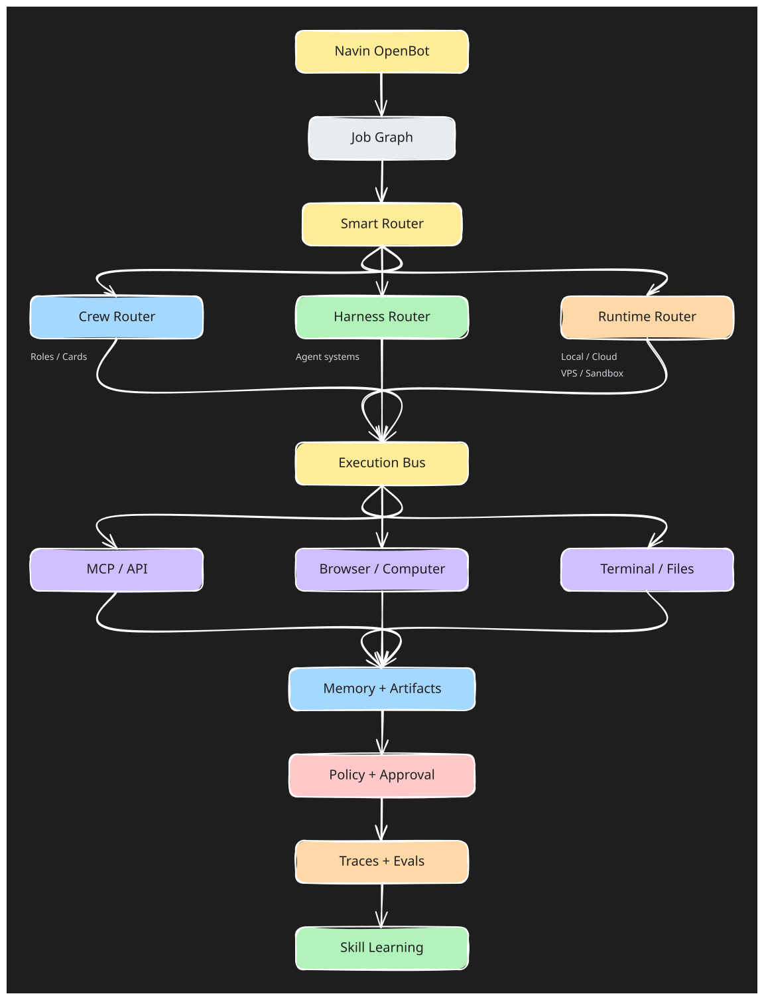
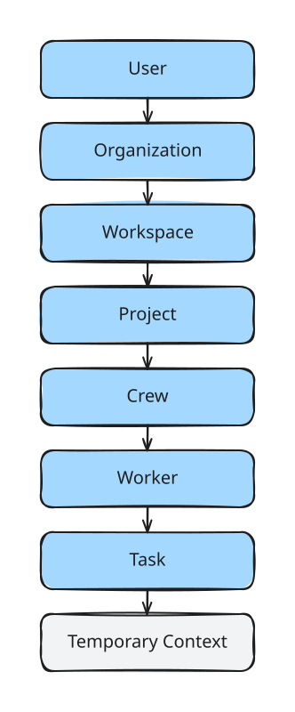

# Architecture

## Architectural Thesis

OpenBot separates the layers that many agent products bundle together.

  <picture>
    <source media="(prefers-color-scheme: dark)" srcset="./diagrams/architecture-dark.svg" />
    
  </picture>

## Core Layers

### 1. Job / Task Graph
Represents user intent, decomposed work, dependencies, ownership, and completion state.

### 2. Crew
One or more workers with roles, permissions, memory access, tools, budgets, and execution configuration.

### 3. Router
Selects or validates:
- worker
- model
- harness
- runtime
- tools
- budget / constraints

Routing must be explainable and traceable.

### 4. Provider Layer
Normalizes model access without making core dependent on one provider.

### 5. Harness Layer
Adapters for native and external agent harnesses.

Potential adapters:
- OpenBot native
- Claude Code
- Codex
- OpenCode
- Pi
- OpenHands
- third-party/custom harnesses

### 6. Runtime Layer
Execution environments:
- local
- container
- cloud
- VPS
- sandbox
- SSH/remote
- GPU
- private infrastructure
- edge

### 7. Execution Bus
Common capability surface for:
- MCP
- APIs
- browser/computer use
- terminal
- filesystem
- applications
- custom tools

### 8. Memory
Scoped stores with ownership and ACL.

Suggested scopes:
`user → organization → workspace → project → crew → worker → task → ephemeral`

  <picture>
    <source media="(prefers-color-scheme: dark)" srcset="./diagrams/memory-scopes-dark.svg" />
    
  </picture>

Suggested metadata:
- owner
- scope
- source
- timestamp
- confidence
- TTL
- permissions
- provenance

### 9. Artifacts
Files, reports, code, screenshots, logs, datasets, messages, and other outputs produced by runs.

### 10. Policy / Approval
Explicit permission and review layer.

Examples:
- tool access
- filesystem scope
- network scope
- secrets
- spending
- token budget
- production changes
- external communication

### 11. Trace / Replay
Every important action should be attributable to:
- run
- worker
- model
- harness
- runtime
- tool
- policy decision
- human approval

### 12. Evaluation / Learning
Uses run history to compare configurations and identify reusable behavior.

## Boundary Rules

Core must not assume:
- one model
- one harness
- one browser provider
- one sandbox provider
- one memory backend
- one vector database
- one deployment environment

Use adapters and explicit contracts.

## Beginner vs Power User

Default:
`Auto route + safe runtime + minimal configuration`

Advanced:
manual overrides for every major layer.

Complexity should be available, not mandatory.
