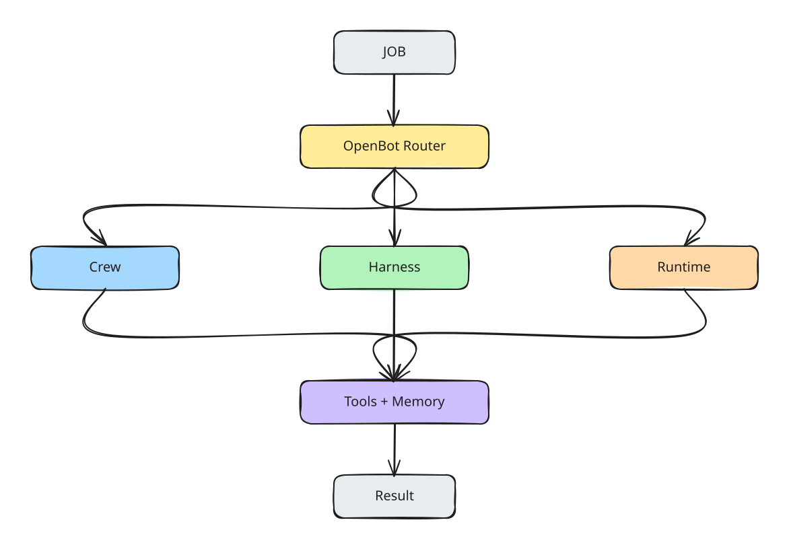
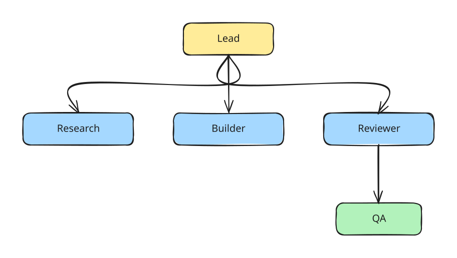

# Product Specification

## One-Sentence Definition

Navin OpenBot is a configurable system that assembles the right crew, models, harnesses, tools, and machines around a job, while leaving every important part replaceable.

## Problem

Modern agent systems often force early choices:
- one model
- one provider
- one harness
- one runtime
- one memory design
- one coordination pattern

OpenBot reverses the dependency: **the job defines the stack, not the stack defining the job.**

  <picture>
    <source media="(prefers-color-scheme: dark)" srcset="./diagrams/job-router-dark.svg" />
    
  </picture>

## User Promise

A user should be able to:

1. describe the outcome
2. let OpenBot select or accept the desired configuration
3. watch or steer the work
4. approve sensitive actions
5. receive finished artifacts/results
6. reuse what worked later

## User Levels

### Beginner
- start with one worker
- select or equip a Deck
- minimal configuration
- default routing
- default runtime
- clear approvals

### Advanced
- replace models
- replace harnesses
- define routing rules
- choose runtimes
- configure memory scopes
- build Cards and Decks
- define policies
- inspect traces
- evaluate variants

### Teams / Organizations
- shared Decks
- organization memory
- permission boundaries
- private components
- centralized policies
- auditability
- private infrastructure

## Work Modes

### Solo
One worker handles a job.

### Cowork
The user and worker operate together with frequent steering.

### Dual
One worker produces; another independently reviews.

### Team
A Crew decomposes and hands off work among specialized roles.

  <picture>
    <source media="(prefers-color-scheme: dark)" srcset="./diagrams/crew-dark.svg" />
    
  </picture>

### Arena
Multiple configurations receive the same task, budget, and constraints for measured comparison.

## Differentiators

1. Multi-provider
2. Multi-harness
3. Runtime Mesh
4. adaptive routing
5. hierarchical/scoped memory
6. Teach → Skill → Compile
7. Cards and Decks
8. replay / time machine
9. evals and skill CI/CD
10. explicit policy and approval layer
11. marketplace with measurable evidence
12. experimental Brain runtime interface

## UX Principle

Advanced architecture must not become advanced onboarding.

The default path should feel like:

`Give job → OpenBot assembles work → approve only when needed → receive result`

Power users can open the stack and replace any layer.

## Non-Goals

OpenBot is not:
- a new foundation model
- only a coding agent
- only a multi-agent chat UI
- only a prompt marketplace
- a claim that autonomous work needs no human control
- a claim that biological systems replace general LLM reasoning
