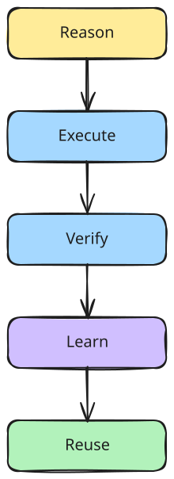
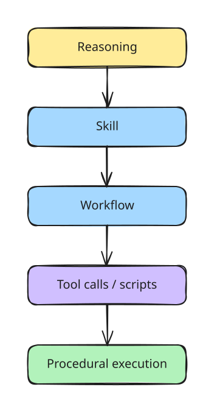

# Research Direction

## Purpose

OpenBot is a product first, but several product problems are also research questions.

Research prototypes must remain clearly separated from production guarantees.

## Core Research Areas

### Adaptive Routing
How should the system choose:
- model
- harness
- runtime
- worker
- tool strategy

Objective variables may include quality, cost, latency, privacy, historical success, and resource availability.

### Long-Horizon Reliability
How to complete multi-step work while reducing:
- drift
- repeated mistakes
- unnecessary reasoning
- lost context
- unsafe actions

### Procedural Memory
How to convert successful trajectories into reusable execution.

Target loop:

`Reason → Execute → Verify → Learn → Reuse`

  <picture>
    <source media="(prefers-color-scheme: dark)" srcset="./diagrams/learning-loop-dark.svg" />
    
  </picture>

### Skill Compilation
Investigate when a successful Skill can move toward:
- workflow graph
- API sequence
- browser automation
- script
- small policy
- deterministic execution

LLM reasoning remains available for exceptions.

  <picture>
    <source media="(prefers-color-scheme: dark)" srcset="./diagrams/compilation-path-dark.svg" />
    
  </picture>

### Evaluation and Replay
How to compare agents and Decks using reproducible runs, budgets, tasks, and measurements.

### Memory Architecture
Study:
- hierarchy
- ACL
- provenance
- confidence
- expiration
- compression
- retrieval
- cross-worker sharing

### Multi-Worker Coordination
Research delegation, handoff, independent review, conflict resolution, and parallel work.

## Synomorph

Synomorph explores specialized non-LLM or hybrid intelligence for constrained tasks.

Candidate systems:
- deterministic procedural logic
- small learned policies
- reservoir computing
- spiking systems
- synthetic neural structures
- biologically inspired connectomes

Potential use cases:
- repeated control loops
- robotics
- navigation
- temporal signals
- anomaly response
- low-latency decisions
- edge execution
- sensor-to-action behavior

## Scientific Constraint

Do not assume biological wiring is better.

Every Synomorph candidate must be compared against simpler alternatives such as:
- scripts
- rules
- workflow graphs
- small neural policies
- conventional controllers
- LLM-only approaches

A Brain runtime is useful only if measured results justify its complexity.

## Product Boundary

Synomorph should appear as:
- Experimental
- Research
- Brain Card / optional runtime

It should not dominate the main OpenBot product story.
